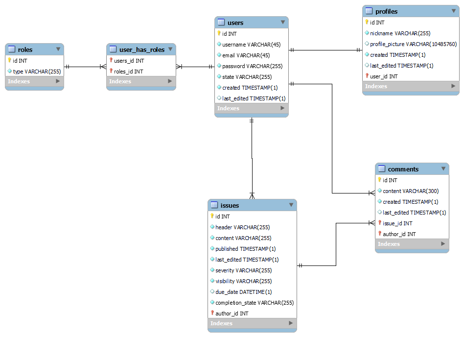

# Unknown's Issue Tracker backend

My own implementation of an issue tracker aimed mostly at my needs.


## Deployment

This project is deployed on [Heroku](https://issue-tracker-upce-heroku.herokuapp.com/swagger-ui/).


## Environment Variables

To run this project, you will need to configure the following environment variables

`DATABASE_URL`
`JWT_SECRET`
`FRONTEND_URL`


## Features

- Issue management
- Comment management
- User management
- Pagination
- Sorting of returned data
- JWT authentication

## Database model



## API Reference

### Comments

#### Get all comments

```http
GET /api/v1/comments/
```

##### Parameters

| Name          | Located in | Description | Required | Schema     |
|---------------|------------|-------------| -------- |------------|
| direction     | query      | direction   | No | string     |
| orderBy       | query      | orderBy     | No | [ string ] |
| pageNumber    | query      | pageNumber  | No | integer    |
| pageSize      | query      | pageSize    | No | integer    |
| Authorization | headers    | JWT token   | No | string     |

##### Responses

| Code | Description | Schema |
| ---- | ----------- | ------ |
| 200 | OK | [CommentPageGetDto](#commentpagegetdto) |
| 401 | Unauthorized |  |
| 403 | Forbidden |  |
| 404 | Not Found |  |

#### Post comment to issue

```http
POST /api/v1/comments/create/{id}
```

##### Parameters

| Name | Located in | Description | Required | Schema |
| ---- | ---------- | ----------- |----------| ---- |
| commentCreateDto | body | commentCreateDto | Yes      | [CommentCreateDto](#commentcreatedto) |
| id | path | id | Yes      | long |
| Authorization | headers    | JWT token   | Yes      | string     |

##### Responses

| Code | Description |
| ---- | ----------- |
| 200 | OK |
| 201 | Created |
| 401 | Unauthorized |
| 403 | Forbidden |
| 404 | Not Found |


#### Delete comment by id

```http
DELETE /api/v1/comments/delete/{id}
```

##### Parameters

| Name | Located in | Description | Required | Schema |
| ---- | ---------- | ----------- | -------- | ---- |
| id | path | id | Yes | long |
| Authorization | headers    | JWT token   | Yes      | string     |

##### Responses

| Code | Description |
| ---- | ----------- |
| 200 | OK |
| 204 | No Content |
| 401 | Unauthorized |
| 403 | Forbidden |

#### Get comments by issue id

```http
GET /api/v1/comments/issue/{id}
```

##### Parameters

| Name | Located in | Description | Required | Schema |
| ---- | ---------- | ----------- |----------| ---- |
| direction | query | direction | No       | string |
| id | path | id | Yes      | long |
| orderBy | query | orderBy | No       | [ string ] |
| pageNumber | query | pageNumber | No       | integer |
| pageSize | query | pageSize | No       | integer |
| Authorization | headers    | JWT token   | No       | string     |

##### Responses

| Code | Description | Schema |
| ---- | ----------- | ------ |
| 200 | OK | [CommentPageGetDto](#commentpagegetdto) |
| 401 | Unauthorized |  |
| 403 | Forbidden |  |
| 404 | Not Found |  |

#### Update comment by id

```http
PUT /api/v1/comments/update/{id}
```

##### Parameters

| Name | Located in | Description | Required | Schema |
| ---- | ---------- | ----------- | -------- | ---- |
| commentUpdateDto | body | commentUpdateDto | Yes | [CommentUpdateDto](#commentupdatedto) |
| id | path | id | Yes | long |
| Authorization | headers    | JWT token   | Yes      | string     |

##### Responses

| Code | Description |
| ---- | ----------- |
| 200 | OK |
| 201 | Created |
| 401 | Unauthorized |
| 403 | Forbidden |
| 404 | Not Found |

#### Get comments by author username

```http
GET /api/v1/comments/user/{username}
```

##### Parameters

| Name | Located in | Description | Required | Schema |
| ---- | ---------- | ----------- | -------- | ---- |
| direction | query | direction | No | string |
| orderBy | query | orderBy | No | [ string ] |
| pageNumber | query | pageNumber | No | integer |
| pageSize | query | pageSize | No | integer |
| username | path | username | Yes | string |
| Authorization | headers    | JWT token   | No       | string     |

##### Responses

| Code | Description | Schema |
| ---- | ----------- | ------ |
| 200 | OK | [CommentPageGetDto](#commentpagegetdto) |
| 401 | Unauthorized |  |
| 403 | Forbidden |  |
| 404 | Not Found |  |

#### Get comment by id

```http
GET /api/v1/comments/{id}
```

##### Parameters

| Name | Located in | Description | Required | Schema |
| ---- | ---------- | ----------- | -------- | ---- |
| id | path | id | Yes | long |
| Authorization | headers    | JWT token   | No       | string     |

##### Responses

| Code | Description | Schema |
| ---- | ----------- | ------ |
| 200 | OK | [CommentGetDto](#commentgetdto) |
| 401 | Unauthorized |  |
| 403 | Forbidden |  |
| 404 | Not Found |  |

### Issues

#### Get all issues

```http
GET /api/v1/issues/
```

##### Parameters

| Name | Located in | Description | Required | Schema |
| ---- | ---------- | ----------- | -------- | ---- |
| direction | query | direction | No | string |
| orderBy | query | orderBy | No | [ string ] |
| pageNumber | query | pageNumber | No | integer |
| pageSize | query | pageSize | No | integer |
| Authorization | headers    | JWT token   | No       | string     |

##### Responses

| Code | Description | Schema |
| ---- | ----------- | ------ |
| 200 | OK | [IssuePageGetDto](#issuepagegetdto) |
| 401 | Unauthorized |  |
| 403 | Forbidden |  |
| 404 | Not Found |  |

#### Post issue

```http
POST /api/v1/issues/create
```

##### Parameters

| Name | Located in | Description | Required | Schema |
| ---- | ---------- | ----------- |----------| ---- |
| issueCreateDto | body | issueCreateDto | Yes      | [IssueCreateDto](#issuecreatedto) |
| Authorization | headers    | JWT token   | Yes      | string     |

##### Responses

| Code | Description |
| ---- | ----------- |
| 200 | OK |
| 201 | Created |
| 401 | Unauthorized |
| 403 | Forbidden |
| 404 | Not Found |

#### Delete issue by id

```http
DELETE /api/v1/issues/delete/{id}
```

##### Parameters

| Name | Located in | Description | Required | Schema |
| ---- | ---------- | ----------- | -------- | ---- |
| id | path | id | Yes | long |
| Authorization | headers    | JWT token   | Yes      | string     |

##### Responses

| Code | Description |
| ---- | ----------- |
| 200 | OK |
| 204 | No Content |
| 401 | Unauthorized |
| 403 | Forbidden |

#### Update issue by id

```http
PUT /api/v1/issues/update/{id}
```

##### Parameters

| Name | Located in | Description | Required | Schema |
| ---- | ---------- | ----------- | -------- | ---- |
| id | path | id | Yes | long |
| issueUpdateDto | body | issueUpdateDto | Yes | [IssueUpdateDto](#issueupdatedto) |
| Authorization | headers    | JWT token   | Yes      | string     |

##### Responses

| Code | Description |
| ---- | ----------- |
| 200 | OK |
| 201 | Created |
| 401 | Unauthorized |
| 403 | Forbidden |
| 404 | Not Found |

#### Get issues by author username

```http
GET /api/v1/issues/user/{username}
```

##### Parameters

| Name | Located in | Description | Required | Schema |
| ---- | ---------- | ----------- |----------| ---- |
| direction | query | direction | No       | string |
| orderBy | query | orderBy | No       | [ string ] |
| pageNumber | query | pageNumber | No       | integer |
| pageSize | query | pageSize | No       | integer |
| username | path | username | Yes      | string |
| Authorization | headers    | JWT token   | No       | string     |

##### Responses

| Code | Description | Schema |
| ---- | ----------- | ------ |
| 200 | OK | [IssuePageGetDto](#issuepagegetdto) |
| 401 | Unauthorized |  |
| 403 | Forbidden |  |
| 404 | Not Found |  |

#### Get issue by id

```http
GET /api/v1/issues/{id}
```

##### Parameters

| Name | Located in | Description | Required | Schema |
| ---- | ---------- | ----------- | -------- | ---- |
| id | path | id | Yes | long |
| Authorization | headers    | JWT token   | No       | string     |

##### Responses

| Code | Description | Schema |
| ---- | ----------- | ------ |
| 200 | OK | [IssueGetDto](#issuegetdto) |
| 401 | Unauthorized |  |
| 403 | Forbidden |  |
| 404 | Not Found |  |

### Authentication

#### Login

```http
POST /api/v1/login
```

##### Parameters

| Name | Located in | Description | Required | Schema |
| ---- | ---------- | ----------- | -------- | ---- |
| loginRequest | body | loginRequest | Yes | [JwtRequest](#jwtrequest) |

##### Responses

| Code | Description | Schema |
| ---- | ----------- | ------ |
| 200 | OK | object |
| 201 | Created |  |
| 401 | Unauthorized |  |
| 403 | Forbidden |  |
| 404 | Not Found |  |

#### Register

```http
POST /api/v1/register
```

##### Parameters

| Name | Located in | Description | Required | Schema |
| ---- | ---------- | ----------- | -------- | ---- |
| userRegisterDto | body | userRegisterDto | Yes | [ApplicationUserCreateDto](#applicationusercreatedto) |

##### Responses

| Code | Description |
| ---- | ----------- |
| 200 | OK |
| 201 | Created |
| 401 | Unauthorized |
| 403 | Forbidden |
| 404 | Not Found |

### Users

#### Get users

```http
GET /api/v1/users/
```

##### Parameters

| Name | Located in | Description | Required | Schema |
| ---- | ---------- | ----------- | -------- | ---- |
| direction | query | direction | No | string |
| orderBy | query | orderBy | No | [ string ] |
| pageNumber | query | pageNumber | No | integer |
| pageSize | query | pageSize | No | integer |
| Authorization | headers    | JWT token   | No       | string     |

##### Responses

| Code | Description | Schema |
| ---- | ----------- | ------ |
| 200 | OK | [ApplicationUserPageGetDto](#applicationuserpagegetdto) |
| 401 | Unauthorized |  |
| 403 | Forbidden |  |
| 404 | Not Found |  |

#### Delete user by id

```http
DELETE /api/v1/users/delete/{id}
```

##### Parameters

| Name | Located in | Description | Required | Schema |
| ---- | ---------- | ----------- |----------| ---- |
| id | path | id | Yes      | long |
| Authorization | headers    | JWT token   | Yes      | string     |

##### Responses

| Code | Description |
| ---- | ----------- |
| 200 | OK |
| 204 | No Content |
| 401 | Unauthorized |
| 403 | Forbidden |

#### Get user by id

```http
GET /api/v1/users/id/{id}
```

##### Parameters

| Name | Located in | Description | Required | Schema |
| ---- | ---------- | ----------- | -------- | ---- |
| id | path | id | Yes | long |
| Authorization | headers    | JWT token   | No       | string     |

##### Responses

| Code | Description | Schema |
| ---- | ----------- | ------ |
| 200 | OK | [ApplicationUserGetDto](#applicationusergetdto) |
| 401 | Unauthorized |  |
| 403 | Forbidden |  |
| 404 | Not Found |  |

#### Update user password by id

```http
PUT /api/v1/users/update/password/{id}
```

##### Parameters

| Name | Located in | Description | Required | Schema |
| ---- | ---------- | ----------- | -------- | ---- |
| id | path | id | Yes | long |
| userUpdateDto | body | userUpdateDto | Yes | [ApplicationUserUpdatePasswordDto](#applicationuserupdatepassworddto) |
| Authorization | headers    | JWT token   | Yes      | string     |

##### Responses

| Code | Description |
| ---- | ----------- |
| 200 | OK |
| 201 | Created |
| 401 | Unauthorized |
| 403 | Forbidden |
| 404 | Not Found |

#### Update user by id

```http
PUT /api/v1/users/update/{id}
```

##### Parameters

| Name | Located in | Description | Required | Schema |
| ---- | ---------- | ----------- | -------- | ---- |
| id | path | id | Yes | long |
| userUpdateDto | body | userUpdateDto | Yes | [ApplicationUserUpdateDto](#applicationuserupdatedto) |
| Authorization | headers    | JWT token   | Yes      | string     |

##### Responses

| Code | Description |
| ---- | ----------- |
| 200 | OK |
| 201 | Created |
| 401 | Unauthorized |
| 403 | Forbidden |
| 404 | Not Found |

#### Get user by username

```http
GET /api/v1/users/{username}
```

##### Parameters

| Name | Located in | Description | Required | Schema |
| ---- | ---------- | ----------- |----------| ---- |
| username | path | username | Yes      | string |
| Authorization | headers    | JWT token   | No       | string     |

##### Responses

| Code | Description | Schema |
| ---- | ----------- | ------ |
| 200 | OK | [ApplicationUserGetDto](#applicationusergetdto) |
| 401 | Unauthorized |  |
| 403 | Forbidden |  |
| 404 | Not Found |  |

### Models

#### ApplicationUserCreateDto

| Name | Type | Description | Required |
| ---- | ---- | ----------- | -------- |
| email | string |  | Yes |
| password | string |  | Yes |
| profile | [ProfileCreateDto](#profilecreatedto) |  | No |
| username | string |  | Yes |

#### ApplicationUserGetDto

| Name | Type | Description | Required |
| ---- | ---- | ----------- | -------- |
| created | [Timestamp](#timestamp) |  | No |
| email | string |  | Yes |
| id | long |  | No |
| lastEdited | [Timestamp](#timestamp) |  | No |
| profile | [ProfileGetDto](#profilegetdto) |  | No |
| roles | [ [RoleGetDto](#rolegetdto) ] |  | No |
| state | string | _Enum:_ `"ACTIVE"`, `"BANNED"`, `"INACTIVE"` | Yes |
| username | string |  | Yes |

#### ApplicationUserPageGetDto

| Name | Type | Description | Required |
| ---- | ---- | ----------- | -------- |
| currentPage | integer |  | No |
| totalItems | long |  | No |
| totalPages | integer |  | No |
| users | [ [ApplicationUserGetDto](#applicationusergetdto) ] |  | No |

#### ApplicationUserUpdateDto

| Name | Type | Description | Required |
| ---- | ---- | ----------- | -------- |
| email | string |  | No |
| profile | [ProfileUpdateDto](#profileupdatedto) |  | Yes |
| state | string |  | Yes |

#### ApplicationUserUpdatePasswordDto

| Name | Type | Description | Required |
| ---- | ---- | ----------- | -------- |
| newPassword | string |  | Yes |
| oldPassword | string |  | Yes |

#### CommentCreateDto

| Name | Type | Description | Required |
| ---- | ---- | ----------- | -------- |
| content | string |  | Yes |

#### CommentGetDto

| Name | Type | Description | Required |
| ---- | ---- | ----------- | -------- |
| author | [ApplicationUserGetDto](#applicationusergetdto) |  | No |
| content | string |  | No |
| created | [Timestamp](#timestamp) |  | No |
| id | long |  | No |
| lastEdited | [Timestamp](#timestamp) |  | No |

#### CommentPageGetDto

| Name | Type | Description | Required |
| ---- | ---- | ----------- | -------- |
| comments | [ [CommentGetDto](#commentgetdto) ] |  | No |
| currentPage | integer |  | No |
| totalItems | long |  | No |
| totalPages | integer |  | No |

#### CommentUpdateDto

| Name | Type | Description | Required |
| ---- | ---- | ----------- | -------- |
| content | string |  | Yes |

#### IssueCreateDto

| Name | Type | Description | Required |
| ---- | ---- | ----------- | -------- |
| content | string |  | Yes |
| dueDate | dateTime |  | No |
| header | string |  | Yes |
| severity | string |  | Yes |
| visibility | string |  | Yes |

#### IssueGetDto

| Name | Type | Description | Required |
| ---- | ---- | ----------- | -------- |
| author | [ApplicationUserGetDto](#applicationusergetdto) |  | No |
| completionState | string | _Enum:_ `"DONE"`, `"IN_PROGRESS"`, `"TODO"` | Yes |
| content | string |  | No |
| dueDate | dateTime |  | No |
| header | string |  | No |
| id | long |  | No |
| lastEdited | [Timestamp](#timestamp) |  | No |
| published | [Timestamp](#timestamp) |  | No |
| severity | string | _Enum:_ `"HIGH"`, `"LOW"`, `"MEDIUM"` | Yes |
| visibility | string | _Enum:_ `"INTERNAL"`, `"PRIVATE"`, `"PUBLIC"` | Yes |

#### IssuePageGetDto

| Name | Type | Description | Required |
| ---- | ---- | ----------- | -------- |
| currentPage | integer |  | No |
| issues | [ [IssueGetDto](#issuegetdto) ] |  | No |
| totalItems | long |  | No |
| totalPages | integer |  | No |

#### IssueUpdateDto

| Name | Type | Description | Required |
| ---- | ---- | ----------- | -------- |
| completionState | string |  | Yes |
| content | string |  | Yes |
| dueDate | dateTime |  | No |
| header | string |  | Yes |
| severity | string |  | Yes |
| visibility | string |  | Yes |

#### JwtRequest

| Name | Type | Description | Required |
| ---- | ---- | ----------- | -------- |
| password | string |  | No |
| username | string |  | No |

#### ProfileCreateDto

| Name | Type | Description | Required |
| ---- | ---- | ----------- | -------- |
| nickname | string |  | Yes |
| profilePicture | string |  | No |

#### ProfileGetDto

| Name | Type | Description | Required |
| ---- | ---- | ----------- | -------- |
| created | Timestamp |  | No |
| id | long |  | No |
| lastEdited | Timestamp |  | No |
| nickname | string |  | Yes |
| profilePicture | string |  | No |

#### ProfileUpdateDto

| Name | Type | Description | Required |
| ---- | ---- | ----------- | -------- |
| nickname | string |  | Yes |
| profilePicture | string |  | No |

#### RoleGetDto

| Name | Type | Description | Required |
| ---- | ---- | ----------- | -------- |
| type | string | _Enum:_ `"ROLE_ADMIN"`, `"ROLE_USER"` | No |

## Related

Link to frontend repository

[Frontend](https://github.com/Unkn0wn126/nnpia_sem_pr_frontend)


## Acknowledgements

 - [Readme created with readme.so](https://readme.so)
 - [Made with the help of Baeldung tutorials](https://www.baeldung.com/)
 - [Made with the help of Bezkoder tutorials](https://www.bezkoder.com/)
 - [Made with the help of Petr Filip's tutorials](https://www.youtube.com/c/PetrFilipTix)
